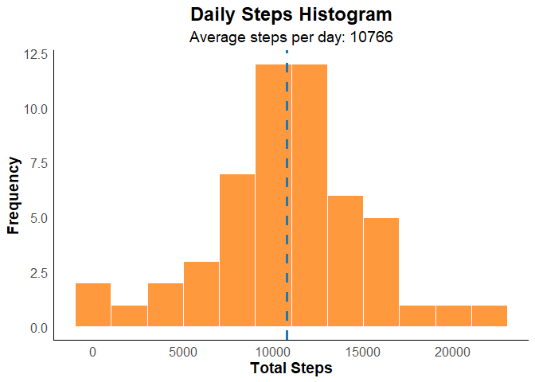
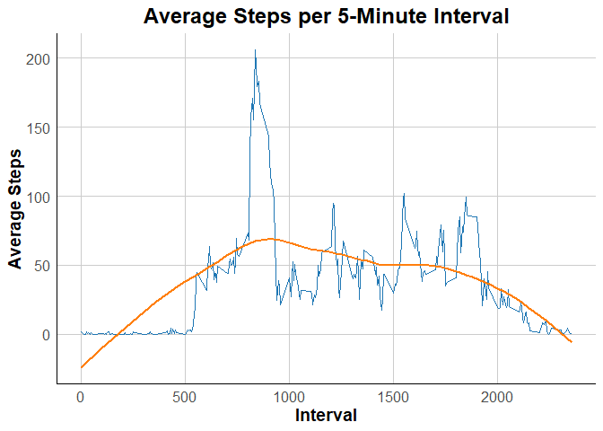
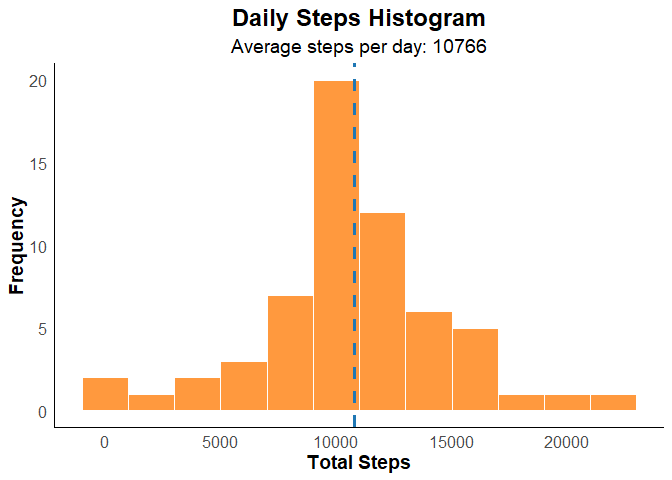
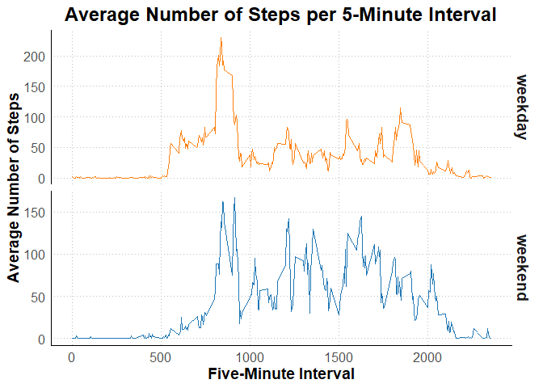

## Introduction
It is now possible to collect a large amount of data about personal movement using activity monitoring devices such as a [Fitbit](http://www.fitbit.com/), [Nike Fuelband](http://www.nike.com/us/en_us/c/nikeplus-fuelband), or [Jawbone Up](https://jawbone.com/up). These type of devices are part of the “quantified self” movement – a group of enthusiasts who take measurements about themselves regularly to improve their health, to find patterns in their behavior, or because they are tech geeks. But these data remain under-utilized both because the raw data are hard to obtain and there is a lack of statistical methods and software for processing and interpreting the data.

This assignment makes use of data from a personal activity monitoring device. This device collects data at 5 minute intervals through out the day. The data consists of two months of data from an anonymous individual collected during the months of October and November, 2012 and include the number of steps taken in 5 minute intervals each day. We will be answering a series of questions throughout this document that give insight into the data on a variety of levels. 

The data for this assignment can be downloaded from the course web site:

Dataset: [Activity monitoring data](https://d396qusza40orc.cloudfront.net/repdata%2Fdata%2Factivity.zip) [52K]

The variables included in this dataset are:

- steps: Number of steps taking in a 5-minute interval (missing values are coded as NA)

- date: The date on which the measurement was taken in YYYY-MM-DD format

- interval: Identifier for the 5-minute interval in which measurement was taken

The dataset is stored in a comma-separated-value (CSV) file and there are a total of 17,568 observations in this dataset.


## Loading and Pre-Processing the Data
We must first take the raw data and transform it into something useful for analysis. The only initial change is to turn the "date" column into a Date datatype for use later on.


```r
# read the data into a data frame called fitData
fitData <- read.csv("activity.csv")

# convert the date column into a date datatype
fitData$date <- as.Date(fitData$date)

# show the first 5 rows of data
head(fitData,5)
```

```
##   steps       date interval
## 1    NA 2012-10-01        0
## 2    NA 2012-10-01        5
## 3    NA 2012-10-01       10
## 4    NA 2012-10-01       15
## 5    NA 2012-10-01       20
```

Now we can begin answering the core questions of this assignment and gain insight into 
the data as we go along. 


## What is the Mean Total Number of Steps Taken Per Day?

To answer the question of mean total number of steps we will break it down into three sub-parts. 

### Total Steps

First, we calculate the total number of steps (removing NA rows) for the data.


```r
# calculate the total steps per day and put the result in a data frame
total_steps <- aggregate(steps ~ date, data = fitData, FUN = function(x) sum(x, na.rm = TRUE))

# Display the first five rows of total_steps
head(total_steps, 5)
```

```
##         date steps
## 1 2012-10-02   126
## 2 2012-10-03 11352
## 3 2012-10-04 12116
## 4 2012-10-05 13294
## 5 2012-10-06 15420
```

### Histogram of the total number of steps taken each day

Second, to get a better sense of the data, we take a "bird's eye view" by creating
a histogram of the total steps taken each day. 


```r
# organize our data into total steps per day, ignoring NA values
daily_steps <- fitData %>%
    na.omit() %>%
    group_by(date) %>%
    summarise(total_steps = sum(steps))

# Create a histogram with our total steps per day data
steps_histogram <- ggplot(daily_steps, aes(x = total_steps)) +
  geom_histogram(binwidth = 2000, fill = "#FF7F0E", color = "white", alpha = 0.8) +
  geom_vline(aes(xintercept = mean(total_steps)), color = "#1F77B4", linetype = "dashed", size = 1.2) +
  labs(title = "Daily Steps Histogram",
       subtitle = "Average steps per day: 10766",
       x = "Total Steps",
       y = "Frequency") +
  theme_minimal() +
  theme(plot.title = element_text(size = 18, face = "bold", hjust = 0.5),
        plot.subtitle = element_text(size = 14, hjust = 0.5),
        axis.title.x = element_text(size = 14, face = "bold"),
        axis.title.y = element_text(size = 14, face = "bold"),
        axis.text = element_text(size = 12),
        panel.grid.major = element_blank(),
        panel.grid.minor = element_blank(),
        panel.border = element_blank(),
        panel.background = element_blank(),
        axis.line = element_line(color = "black")) +
  scale_fill_gradient(low = "#FF7F0E", high = "#FFC100")

# Print the steps_histogram to the screen
print(steps_histogram)
```

<!-- -->

### Calculate the mean and the median of the total number of steps taken per day

Finally, we calculate the mean and median of the total steps taken per day. 


```r
# Calculate mean and median
mean_daily_steps <- mean(daily_steps$total_steps)
median_daily_steps <- median(daily_steps$total_steps)

# Display the mean and median
cat("Mean of total steps per day: ", mean_daily_steps, "\n")
```

```
## Mean of total steps per day:  10766.19
```

```r
cat("Median of total steps per day: ", median_daily_steps)
```

```
## Median of total steps per day:  10765
```

## What is the Average Daily Activity Pattern?

Now we move on to the average daily activity pattern. We can break this down into two parts
for easy consumption.

### Time Series Plot

First, a time-series plot of the five-minute interval (x-axis) and the average number of steps taken,
which is then averaged across all days (y-axis) is plotted.


```r
# Using 'fitData' as the data frame name
average_interval_steps <- fitData %>%
    filter(!is.na(steps)) %>% # Remove any rows with NA values for steps
    group_by(interval) %>%
    summarise(average_steps = mean(steps))

# Create a time series plot that looks good
steps_time_series_plot <- ggplot(average_interval_steps, aes(x = interval, y = average_steps)) +
    geom_line(color = "#1F77B4") +
    geom_smooth(color = "#FF7F0E", se = FALSE) +
    labs(title = "Average Steps per 5-Minute Interval",
         x = "Interval",
         y = "Average Steps") +
    theme_minimal() +
    theme(plot.title = element_text(size = 18, face = "bold", hjust = 0.5),
          axis.title.x = element_text(size = 14, face = "bold"),
          axis.title.y = element_text(size = 14, face = "bold"),
          axis.text = element_text(size = 12),
          panel.grid.major = element_line(color = "grey80"),
          panel.grid.minor = element_blank(),
          panel.border = element_blank(),
          panel.background = element_blank(),
          axis.line = element_line(color = "black")) +
    scale_color_gradient(low = "#1F77B4", high = "#FF7F0E")

# Print the time series plot
print(steps_time_series_plot)
```

<!-- -->

### Five-Minute Interval (Averaged Across All Days) with Max Steps

Second, we calculate which five-minute interval, on average across all the days in the dataset,
contains the manimum number of steps. Keep in mind the dataset used is the one that has removed
all NA values (average_interval_steps)


```r
# Using 'fitData' as the data frame name
average_interval_steps <- fitData %>%
    filter(!is.na(steps)) %>% # Remove any rows with NA values for steps
    group_by(interval) %>%
    summarise(average_steps = mean(steps))

# Find the interval with the highest average number of steps
max_interval <- average_interval_steps %>%
    filter(average_steps == max(average_steps)) %>%
    pull(interval)

# Print the result
cat("The Five-Minute Interval (Averaged Across All Days) with the Maximum Number of Steps","\n", "and NA Values Removed is", max_interval)
```

```
## The Five-Minute Interval (Averaged Across All Days) with the Maximum Number of Steps 
##  and NA Values Removed is 835
```

## Imputing missing values

This section is really exciting! Here we address the question of imputing (replacing) missing values.
We break this down into four steps to get at the heart of the problem. 

### Total Number of Missing (NA) Values

First, we need to figure out how many NA values we are dealing with in the dataset. 
If the number may have an impact on the impute method chosen. For example, if there 
are only a few missing values, it might be reasonable to simply remove those rows from 
the dataset or fill in the missing values using the mean or median of the available data. 
However, if there are many missing values, a more sophisticated imputation method might be 
necessary, such as using a predictive model or multiple imputation.


```r
# calculate the total missing values
total_missing_values <- sum(is.na(fitData$steps))

# Print the total_missing_values
cat("The total number of missing values in the dataset is", total_missing_values)
```

```
## The total number of missing values in the dataset is 2304
```
### Create a New Dataset with Missing Data Filled In Using the Mean

Second, we need to decide on an impute methodology and implement it to create a new 
dataset. Fortunately, the amount of missing data is relatively small so we can use 
a simple mean imputation method. 


```r
# Use the mean to fill in missing data
fill_mean <- function(x) replace(x, is.na(x), mean(x, na.rm = TRUE))

# create a new dataset that uses these values
filled_fitData <- fitData %>% 
    group_by(interval) %>% 
    mutate(steps = fill_mean(steps))

# Print the first 5 rows of the filled dataset to verify the results
head(filled_fitData, n = 5)
```

```
## # A tibble: 5 × 3
## # Groups:   interval [5]
##    steps date       interval
##    <dbl> <date>        <int>
## 1 1.72   2012-10-01        0
## 2 0.340  2012-10-01        5
## 3 0.132  2012-10-01       10
## 4 0.151  2012-10-01       15
## 5 0.0755 2012-10-01       20
```

### Histogram of the Total Steps / Day with Filled In Data

Third, we diplay a visual representation of the data for comparison with the previous, 
non-filled, data. 


```r
# Using 'filled_fitData' as the data frame name
daily_steps <- filled_fitData %>%
    group_by(date) %>%
    summarise(total_steps = sum(steps))

# Create a histogram plot following Steele and Iliinsky's principles
filled_data_histogram <- ggplot(daily_steps, aes(x = total_steps)) +
    geom_histogram(binwidth = 2000, fill = "#FF7F0E", color = "white", alpha = 0.8) +
    geom_vline(aes(xintercept = mean(total_steps)), color = "#1F77B4", linetype = "dashed", size = 1.2) +
    labs(title = "Daily Steps Histogram",
         subtitle = "Average steps per day: 10766",
         x = "Total Steps",
         y = "Frequency") +
    theme_minimal() +
    theme(plot.title = element_text(size = 18, face = "bold", hjust = 0.5),
          plot.subtitle = element_text(size = 14, hjust = 0.5),
          axis.title.x = element_text(size = 14, face = "bold"),
          axis.title.y = element_text(size = 14, face = "bold"),
          axis.text = element_text(size = 12),
          panel.grid.major = element_blank(),
          panel.grid.minor = element_blank(),
          panel.border = element_blank(),
          panel.background = element_blank(),
          axis.line = element_line(color = "black")) +
    scale_fill_gradient(low = "#FF7F0E", high = "#FFC100")

# Print the Beautiful Visualization-inspired histogram plot
print(filled_data_histogram)
```

<!-- -->

### Calculate the mean and the median of the total number of steps taken per day with filled in data

Finally, for comparison with the non-filled data, we calculate the mean and median. 


```r
# Using 'filled_fitData' as the data frame name
daily_steps <- filled_fitData %>%
    group_by(date) %>%
    summarise(total_steps = sum(steps, na.rm = TRUE))

# Calculate and report the mean and median total number of steps taken per day
mean_steps <- mean(daily_steps$total_steps)
median_steps <- median(daily_steps$total_steps)
cat("The mean total number of steps taken per day is", round(mean_steps), "steps.\n")
```

```
## The mean total number of steps taken per day is 10766 steps.
```

```r
cat("The median total number of steps taken per day is", median_steps, "steps.")
```

```
## The median total number of steps taken per day is 10766.19 steps.
```
#### Analysis Compared to Prior Mean and Median
**Do these values differ from the estimates from the first part of the assignment?** 

These values remain relatively unchanged from pre-replacement of NA values to post-replacement.

**What is the impact of imputing missing data on the estimates of the total daily number of steps?**

The impact of imputing the missing data is, essentially, not noticeable.

## Are There Differences in Activity Patterns Between Weekdays and Weekends?

The final part of the project looks at the activity from the point of view of weekdays and weekends.
We will do this in two steps.

### Add a Factor Variable Showing Each Day as a Weekday or Weekend

First, we need to determine if each day in our data is a weekday or a weekend day. 
To do this we create a new column with each day labled appropriately.


```r
# Using 'filled_fitData' as the data frame name
filled_fitData$day_type <- factor(ifelse(weekdays(as.Date(filled_fitData$date)) %in% c("Saturday", "Sunday"), "weekend", "weekday"))

# Print the first 5 rows of the modified dataset to verify the results
head(filled_fitData, n = 5)
```

```
## # A tibble: 5 × 4
## # Groups:   interval [5]
##    steps date       interval day_type
##    <dbl> <date>        <int> <fct>   
## 1 1.72   2012-10-01        0 weekday 
## 2 0.340  2012-10-01        5 weekday 
## 3 0.132  2012-10-01       10 weekday 
## 4 0.151  2012-10-01       15 weekday 
## 5 0.0755 2012-10-01       20 weekday
```

### Time Series Panel Plot Showing Average Steps Across Week and Weekend Days (Five-Minute Average)

Finally, now that we have our days labeled, we can create a panel plot containing a time series 
of the five-minute interval (x-axis) and the average number of steps taken, averaged across 
all weekday days or weekend days (y-axis).


```r
# Calculate the average number of steps for each interval and day type
avg_steps <- filled_fitData %>%
    group_by(interval, day_type) %>%
    summarise(avg_steps = mean(steps, na.rm = TRUE))

# Calculate the average number of steps for each interval and day type
avg_steps <- filled_fitData %>%
    group_by(interval, day_type) %>%
    summarise(avg_steps = mean(steps, na.rm = TRUE))

# Create a panel plot
average_steps_plot <- ggplot(avg_steps, aes(x = interval, y = avg_steps, color = day_type)) +
    geom_line() +
    facet_grid(day_type ~ ., scales = "free_y") +
    labs(title = "Average Number of Steps per 5-Minute Interval",
         x = "Five-Minute Interval",
         y = "Average Number of Steps") +
    scale_color_manual(values = c("#FF7F0E", "#1F77B4")) +
    theme_minimal() +
    theme(plot.title = element_text(size = 18, face = "bold", hjust = 0.5),
          axis.title.x = element_text(size = 14, face = "bold"),
          axis.title.y = element_text(size = 14, face = "bold"),
          axis.text = element_text(size = 12),
          strip.text = element_text(size = 14, face = "bold"),
          panel.grid.major = element_line(color = "gray", linetype = "dotted"),
          panel.grid.minor = element_blank(),
          panel.border = element_blank(),
          panel.background = element_blank(),
          axis.line = element_line(color = "black"),
          legend.position = "none")


# Print the panel plot
print(average_steps_plot)
```

<!-- -->

## Conclusion
In this assignment we made use of data from a personal activity monitoring device and provided insight into that data. We answered a series of questions that will help drive deeper analysis going forward.  
